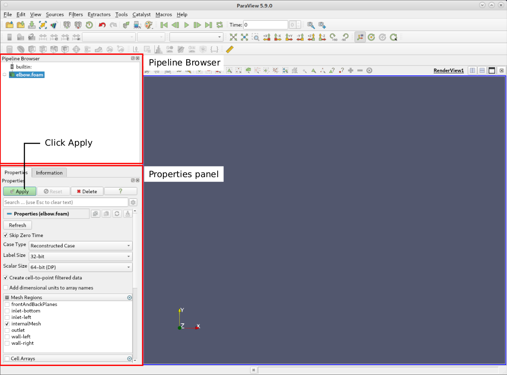
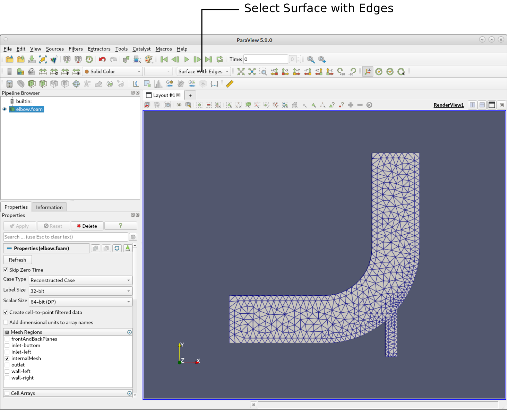

# Pre-processing

Before the simulation can be run, you have to import the mesh and configure the case. The following section explains the fundamental setup for the elbow case and goes through each file of the elbow case.

## OpenFOAM case structure

A case being simulated involves data for mesh, fields, properties, control parameters, etc. In OpenFOAM this data is stored in a set of files within a case directory rather than in a single case file, as in many other CFD packages. The case directory is given a suitably descriptive name, here `elbow`. This folder contains the following subfolders and files:

```
elbow
├── 0
│   ├── p
│   └── U
├── constant
│   └── momentumProperties
│   └── physicalProperties
└── system
    ├── controlDict
    ├── fvSchemes
    └── fvSolution

3 directories, 7 files
```

`0` - This folder is a special time directory that contains the initial conditions and boundary conditions for starting the simulation. In this tutorial:
  * `p` and `U` for the pressure and velocity fields, repectively.

`constant` - This directory contains files that are related to the physics of the problem, including the mesh and any physical properties that are required for the solver. In this case:
  * `momentumProperties` configures the choice of turbulence modelling method, e.g. laminar, Reynolds-averaged Navier-Stokes (RANS) or Large Eddy simulation (LES).
  * `physicalProperties` has the thermophysical properties of the fluid, e.g. rheological model, and viscosity.

`system` - This folder contains files related to how the simulation is to be solved.
  * `controlDict` for setting control parameters including start/end time, time step size and parameters for data output.
  * `fvSchemes` holds the discretisation schemes used in the solution selected during runtime.
  * `fvSolution` for setting the equation solvers, tolerances, relaxation factors and other algorithm controls for the run.


## Mesh generation

The mesh for this case has been created using an external software and is stored in the ANSYS Fluent mesh format `*.msh`. OpenFOAM offers many different utilities for importing mesh files into the OpenFOAM format and storing them in the `constant/polyMesh` folder. In this case, when the terminal's working directory is the `elbow` case folder, the mesh can be imported using the following command:
```
fluentMeshToFoam elbow.msh
```
Here, `fluentMeshToFoam` is the executable for importing the mesh and `elbow.msh` is the argument pointing towards the mesh file inside the `elbow` case folder. The utlitity sucessfully imports the mesh and confirms this with the output:

```
...
Writing mesh... to "constant/polyMesh"  done.

End

```


## Mesh quality

After importing or generating a computational grid it is always recommended to check the mesh statistics and quality criteria. This can easily be done using the utility `checkMesh` from within the `elbow` folder. Just type in the terminal:

```
checkMesh
```

This will produce the following output to the terminal:

```
// * * * * * * * * * * * * * * * * * * * * * * * * * * * * * * * * * * * * * //
Create time

Create polyMesh for time = 0

Time = 0s

Mesh stats
    points:           1074
    internal points:  0
    faces:            3290
    internal faces:   1300
    cells:            918
    faces per cell:   5
    boundary patches: 6
    point zones:      0
    face zones:       0
    cell zones:       0

Overall number of cells of each type:
    hexahedra:     0
    prisms:        918
    wedges:        0
    pyramids:      0
    tet wedges:    0
    tetrahedra:    0
    polyhedra:     0

Checking topology...
    Boundary definition OK.
    Cell to face addressing OK.
    Point usage OK.
    Upper triangular ordering OK.
    Face vertices OK.
    Number of regions: 1 (OK).

Checking patch topology for multiply connected surfaces...
    Patch               Faces    Points   Surface topology                  
    wall-left           100      206      ok (non-closed singly connected)  
    inlet-left          8        18       ok (non-closed singly connected)  
    inlet-bottom        4        10       ok (non-closed singly connected)  
    outlet              8        18       ok (non-closed singly connected)  
    wall-right          34       70       ok (non-closed singly connected)  
    frontAndBackPlanes  1836     1074     ok (non-closed singly connected)  

Checking geometry...
    Overall domain bounding box (0 -4.53853 -0.937738) (64 64 0.937738)
    Mesh has 2 geometric (non-empty/wedge) directions (1 1 0)
    Mesh has 2 solution (non-empty) directions (1 1 0)
    All edges aligned with or perpendicular to non-empty directions.
    Boundary openness (-1.03633e-18 2.59082e-18 1.15147e-19) OK.
    Max cell openness = 1.87187e-16 OK.
    Max aspect ratio = 2.40135 OK.
    Minimum face area = 0.278218. Maximum face area = 7.72369.  Face area magnitudes OK.
    Min volume = 0.521792. Max volume = 7.36354.  Total volume = 3156.3.  Cell volumes OK.
    Mesh non-orthogonality Max: 36.302 average: 11.1868
    Non-orthogonality check OK.
    Face pyramids OK.
    Max skewness = 0.500248 OK.
    Coupled point location match (average 0) OK.

Mesh OK.

End
```
Starting from the top, this gives us the following mesh statistics (among others):
  * The mesh consists of 1074 points,
  * has 3290 faces in total,
  * has 918 cells with a prism shape,
  * has the six boundary patches named `wall-left`, `inlet-left`, `inlet-bottom`, `outlet`, ` wall-right`, and `frontAndBackPlanes`
  * with 100, 8, 4, 8, 34, and 1836 faces, respectively.

Below follow various relevant mesh quality criteria, such as:
  * Overall domain bounding box of `(0 -4.53853 -0.937738) (64 64 0.937738)`,
  * number of non-empty solution directions of 2 (e.g. a 2-dimensional case),
  * max cell aspect ratio of 2.40135,
  * a minimum and maximum cell volume of 0.521792 and 7.36354, respectively,
  * a maximum mesh non-orthogonality of 36.302, and
  * a max cell skewness of 0.500248.

The final output `Mesh OK.` indicates that no critical problems or errors were found during `checkMesh`. Therefore, we can continue with this mesh and proceed with the simulation.


> **Note**
>
> OpenFOAM always operates in a 3 dimensional Cartesian coordinate system and all geometries are generated in 3 dimensions. OpenFOAM solves the case in 3 dimensions by default but can be instructed to solve in 2 dimensions by specifying a ‘special’ `empty` boundary condition on boundaries normal to the (3rd) dimension for which no solution is required. Here, the mesh is fully two-dimensional. Therefore, OpenFOAM imported it and automatically extruded it by one cell in the $z$-direction and created the `frontAndBackPlanes` patch with type `empty`.


## Boundary and initial conditions

Once the mesh generation is complete, the initial and boundary conditions for the fields are set up for this case. The case is set up to start at time $t = 0$, so the initial field data is stored in a `0` sub-directory. This folder contains 2 files, `p` and `U`, one for each of the pressure and velocity fields whose initial values and boundary conditions must be set. Let us examine file `p`:

```
16  dimensions      [0 2 -2 0 0 0 0];
17
18  internalField   uniform 0;
19
20  boundaryField
21  {
22      inlet-left
23      {
24          type            zeroGradient;
25      }
26
27      inlet-bottom
28      {
29          type            zeroGradient;
30      }
31
32      outlet
33      {
34          type            fixedValue;
35          value           uniform 0;
36      }
37
38      wall-right
39      {
40          type            zeroGradient;
41      }
42
43      wall-left
44      {
45          type            zeroGradient;
46      }
47 
48      frontAndBackPlanes
49      {
50          type            empty;
51      }
52
53  // ************************************************************************* //
```

There are 3 principal entries in field data files:

**dimensions**

  * Specifies the dimensions of the field, here kinematic pressure with the units $\text{m}^2\text{/s}^{2}$. In general, algebraic operations must be performed on properties using consistent units of measurement; in particular, addition, subtraction and equality are only physically meaningful for properties of the same dimensional units. As a safeguard against implementing a meaningless operation, OpenFOAM attaches dimensions to field data and physical properties and performs dimension checking on any tensor operation. The dimension set in OpenFOAM consists of 7 scalars delimited by square backets, e.g.

```
    [0 2 -1 0 0 0 0]
```
where each of the values corresponds to the power of each of the base units of measurement listed in the following table:
| No. | Property           | SI unit       |
|-----|--------------------|---------------|
| 1   | Mass               | kilogram (kg) |
| 2   | Length             | meter (m)     |
| 3   | Time               | second (s)    |
| 4   | Temperature        | Kelvin (K)    |
| 5   | Quantity           | mole (mol)    |
| 6   | Current            | ampere (A)    |
| 7   | Luminous intensity | candela (cd)  |

**internalField**

  * The internal field data which can be **uniform**, described by a single value; or **nonuniform**, where all the values of the field (e.g. for each cell) must be specified.

**boundaryField**

  * The boundary field data consists of a list of all patch names, each with an associated patch type and the corresponding settings.

---

In this case, as in most we encounter, the initial pressure is set to be uniform. Here the pressure is kinematic, and as an incompressible case, its absolute value is not relevant, so is set to uniform 0 for convenience.

For this case, the mesh consists of 6 patches: Both inlets `inlet-left` and `inlet-bottom` are defined as type **zero gradient** with repect to pressure(`type zeroGradient`), the outlet `outlet` as the kinematic pressure set to a **fixed value** of 0 (`type fixedValue`), the walls `wall-left` and `wall-right` are also defined as **zero gradient** with repect to pressure, and the `frontAndBackPlanes` patch represents the front and back planes of the 2D case of type `empty`.

Examining the velocity field `U` file yields:


```
16  dimensions      [0 1 -1 0 0 0 0];
17
18  internalField   uniform (0 0 0);
19
20  boundaryField
21  {
22      inlet-left
23      {
24          type            fixedValue;
25          value           uniform (1 0 0);
26      }
27
28      inlet-bottom
29      {
30          type            fixedValue;
31          value           uniform (0 3 0);
32      }
33
34      outlet
35      {
36          type            zeroGradient;
37      }
38
39      wall-left
40      {
41          type            noSlip;
42      }
43
44      wall-right
45      {
46          type            noSlip;
47      }
48
49      frontAndBackPlanes
50      {
51          type            empty;
52      }
53  }
54
55  // ************************************************************************* //
```

The dimensions are those expected for velocity $\text{m/s}$, the internal field is initialised as uniform zero, which in the case of velocity must be expressed by 3 vector components, i.e. `uniform (0 0 0)`.

The left inlet boundary has a uniform velocity of $1\\,\text{m/s}$ in $x$-direction. Hence, the type is set to **fixed value** with a uniform velocity vector of `(1 0 0)`. Similar to the left inlet, the bottom inlet velocity is $3\\,\text{m/s}$ in $y$-direction and thus is set to **fixed value** with a uniform velocity vector of `(0 3 0)`. The outlet is treated as **zero gradient** boundary with respect to velocity and thus set to type `zeroGradient`. Both walls are defined as **no-slip** and thus their type is of `noSlip`. Finally, the boundary field for velocity requires the same `empty` boundary condition for the `frontAndBackPlanes` patch.


## Physical properties

The physical properties for the fluid are stored in the `physicalProperties` file in the `constant` directory. For an incompressible flow solved with the `simpleFoam` solver, both the viscosity model as well as the kinematic viscosity must be specified. In this tutorial, the fluid is assumed to be Newtonian and its kinematic viscosity `nu`, which is the phonetic label for the Greek symbol $\nu$ by which it is represented in equations, is set to 0.01. Similar to the dimensions of the pressure and velocity fields in the `0` folder, the dimensions of the viscosity have to be specified as $\text{m}^2\text{/s}$.

These settings are represented by the file entries in the `physicalProperties` file as shown below:

```
16
17  viscosityModel  Newtonian;
18
19  nu              [0 2 -1 0 0 0 0] 0.01;
20
21  // ************************************************************************* //
```


## Momentum transport properties

Turbulence modeling in the simulation can be set in the `momentumTransport` file in the `constant` dictionary. In this tutorial case, the flow is assumed to be laminar. Therefore, the `simulationType` is specified to be `laminar` as follows:

```
16
17  simulationType laminar;
18
19  // ************************************************************************* //
```


## Simulation control

Settings related to the control of time (for transient simulations) or iterations (for steady-state simulations) and reading and writing of the solution data are read in from the `controlDict` file in the `system` folder.

> **Note**
>
> Regardless of whether steady-state or transient simulations are performed, OpenFOAM always referes to `startTime`, `endTime` and `deltaT`. In transient simulations, these entries possess the physical meaning of time. However, in steady state simulations time is not considered. Therefore, these entries will simply correspond to the start and end of the simulation in terms of iterations. For example, `endTime` simply referes to the number of iterations, at which the simulation is terminated. Therefore, `deltaT` is typically set to 1 so that time itself will simply act as a iteration counter.

The start/stop times and the time step for the run must be set. OpenFOAM offers great flexibility with time/iteration control. In this tutorial the run starts at iteration 0, which means that OpenFOAM needs to read field data from a directory named 0. Therefore we set the `startFrom` keyword to `startTime` and then specify the `startTime` keyword to be `0`.

The simulation should run until a steady state solution is reached. Since it is unknown how many iterations are needed for this, it is assumed that 1000 iterations are sufficient. Therefore, the end time is set to 1000 at which the simulation should stop. To specify this end time, the `stopAt` entry has to be set as `endTime` and the `endTime` entry to 1000.

As mentioned previously, the time step has no physical meaning in steady state simulations and simply acts as an interation counter when set to 1. Therefore, the `deltaT` entry is just set to 1.

As the simulation progresses, results are written out at certain intervals of iterations that can later be analysed and visualized. The `writeControl` keyword presents several options for setting the iteration interval at which the results are written. Here, the `timeStep` option is selected which specifies that results are written every $n$-th iteration where the value $n$ is specified under the `writeInterval` keyword. In this tutorial, the results should be written out every 100 iterations. Thus, the `writeInterval` entry is set to 100.

OpenFOAM creates a new directory *named after the current iteration*, e.g. 100, on each occasion that it writes a set of data. In the `simpleFoam` solver, it writes out the results for each field, `U` and `p`, into the time directories. For this case, the entries in the `controlDict` are shown below:

```
16
17  application     simpleFoam;
18
19  startFrom       startTime;
20
21  startTime       0;
22
23  stopAt          endTime;
24
25  endTime         1000;
26
27  deltaT          1;
28
29  writeControl    timeStep;
30
31  writeInterval   100;
32
33  purgeWrite      0;
34
35  writeFormat     ascii;
36
37  writePrecision  6;
38
39  writeCompression off;
40
41  timeFormat      general;
42
43  timePrecision   6;
44
45  runTimeModifiable true;
46
47  functions
48  {
49      ...
50  }
51
52  // ************************************************************************* //
```


## Discretisation and linear-solver settings

The user specifies the choice of finite volume discretisation schemes in the `fvSchemes` dictionary in the `system` directory. The specification of the linear equation solvers and tolerances and other algorithm controls is made in the `fvSolution` dictionary, similarly in the `system` directory.

The solver settings in `fvSolution` are as follows:

```
16
17  solvers
18  {
19      p
20      {
21          solver          PCG;
22          preconditioner  DIC;
23          tolerance       1e-06;
24          relTol          0.05;
25      }
26
27      U
28      {
29          solver          PBiCG;
30          preconditioner  DILU;
31          tolerance       1e-05;
32          relTol          0.1;
33      }
34  }
35  
36  SIMPLE
37  {
38  }
39
40  relaxationFactors
41  {
42      fields
43      {
44          p               0.3;
45      }
46      equations
47      {
48          U               0.7;
49      }
50  }
51
52  // ************************************************************************* //
```

The pressure field in the pressure-velocity coupling is solved using a **P**reconditioned **c**onjugate **g**radient solver with a simplified **D**iagonal-based **I**ncomplete **C**holesky preconditioner (`PCG` solver with `DIC` preconditioner). The absolute solver tolerance for each iteration is set to $10^{-6}$ with a relative tolerance of 0.05.

The momentum equation is solved using a **P**reconditioned **bi**-**c**onjugate **g**radient solver with an simplified **D**iagonal-based **I**ncomplete **LU** preconditioner (`PBiCG` solver with `DILU` preconditioner). The tolerance for solving is $10^{-5}$ with a relative tolerance of 0.1.

As the name `simpleFoam` suggests, the **SIMPLE pressure-velocity coupling** algorithm is employed for solving the incompressible flow field. Due to the simplicity of the case, the `SIMPLE` dict is empty and thus no additional entries are specified.

Steady state simultions are highly unstable, if no relaxation factors are used. Therefore, the pressure is relaxed with a factor of 0.3 utilizing **field relaxation**. On the other hand, velocity is relaxed with a factor of 0.7 using **equation relaxation**.

All required discretization schemes are defined in the `fvSchemes` file:

```
16
17  ddtSchemes
18  {
19      default         steadyState;
20  }
21
22  gradSchemes
23  {
24      default         Gauss linear;
25  }
26
27  divSchemes
28  {
29      div(phi,U)      bounded Gauss linearUpwindV cellLimited 1;
30
31      div((nuEff*dev2(T(grad(U))))) Gauss linear;
32  }
33
34  laplacianSchemes
35  {
36      default         Gauss linear corrected;
37  }
38
39  interpolationSchemes
40  {
41      default         linear;
42  }
43
44  snGradSchemes
45  {
46      default         corrected;
47  }
48
49  // ************************************************************************* //
```

The different discretization schemes are as follows:
  * `ddtSchemes` contains the discretization of the first time derivaties $(\partial/\partial t)$. Since this is a steady state simulation, the entry here is set to `steadyState`, effectively setting the time derivatives to zero.
  * `gradSchemes` contains the discreatization of gradient terms. The `Gauss` entry specifies the standard finite volume discretisation of Gaussian integration which requires the interpolation of values from cell centres to face centres. The interpolation scheme is then given by the `linear` entry, meaning second order linear interpolation or central differencing.
  * `divSchemes` contains the discretization of the divergence terms, e.g. the convective fluxes. Here, `div(phi,U)` referes to the discretization of the convective flux with `phi` being the (volumetric) flux and `U` the variable, which is transported by the flux. In this case, the second order accurate **linear upwind** scheme is employed with a gradient limiter `cellLimited 1`. Additionaly, `div((nuEff*dev2(T(grad(U)))))` denotes the divergence of the shear stress tensor in the momentum equation. Since this term is diffusive in nature, it is recommended to discretize it with a central differencing scheme, here `linear`.
  * `laplacianSchemes` contains the discretization of laplacian terms, e.g. second order spatial derivatives $(\partial^2/\partial x^2)$. Here, a central differencing scheme is selected with a **correction** for non-orthogonal meshes `linear corrected`.
  * `interpolationSchemes` contains the discretizion of interpolating of values from cell centers to face centers. Using the central differencing scheme `linear` is the recommended choice.
  * `snGradSchemes` contains the discretization of wall-normal gradients. Similar to the laplacian schemes, a **correction** is employed for non-orthogonal meshes.

> **Note**
>
> Two notes here:
> - The `default` entry simply states that all schemes of this mathematical type are discretized equally using the corresponding scheme.
> - The `bounded` keyword in front of the disrectization of the convective flux under `divSchemes` is required for improved stability in steady-state simulations.


## Viewing the mesh

Before the case is run it is a good idea to view the mesh to check for any errors. The mesh is viewed in ParaView, the post-processing tool supplied with OpenFOAM. The ParaView post-processing is conveniently launched on OpenFOAM case data by executing the `paraview` executable from within the case directory.

Before starting ParaView, an empty file has to be created, which will then be opened with ParaView. Recognized by the file ending `*.foam`, ParaView knows that this is an OpenFOAM case and how to visualize the data. For creating the file, type in the terminal:

```
touch elbow.foam
```

Any UNIX/Linux executable can be run in two ways: as a foreground process, i.e. one in which the shell waits until the command has finished before giving a command prompt; or as a background process, which allows the shell to accept additional commands while it is still running. Since it is convenient to keep ParaView open while running other commands from the terminal, we will launch it in the background using the `&` operator by typing:

```
paraview elbow.foam &
```

This launches the ParaView window and opens the elbow case as shown in the following figure:



In the **Pipeline Browser** on the left, the user can see that ParaView has opened `elbow.foam`, the module for the elbow case. Clicking on the green **Apply** button in the **Properties** panel displays the computational domain. Selecting **Surface with Edges** in the top center menu bar shows the computational mesh as follows:



> **Note:**
>
> Many advanced parameters in the Properties panel are only available by clicking the Advanced Properties gearwheel button at the top of the Properties window, next to the search box.


---

At this point the case is fully set up and the mesh has been checked. Therefore, continue the tutorial with the document [*2-solving.md*](./2-solving.md).
