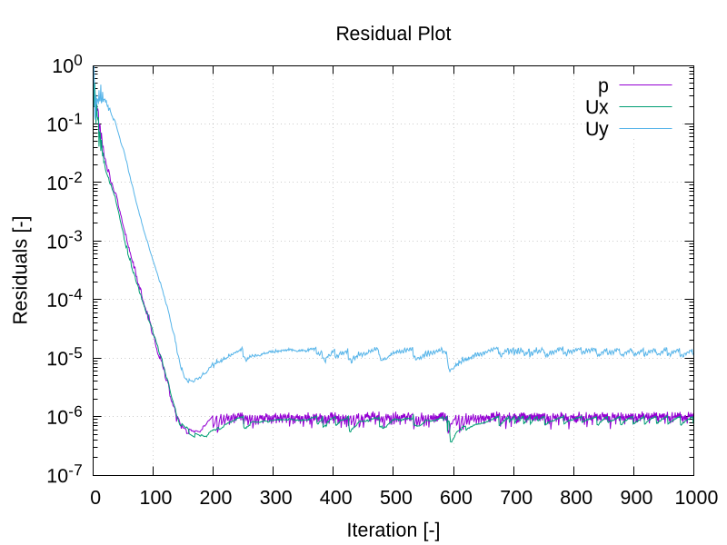

# Solving the case

Like any UNIX/Linux executable, OpenFOAM applications can be run either in the foreground or background of the terminal. On this occasion, we will run `simpleFOam` in the foreground since the simulation will only take a view seconds. The `simpleFoam` solver is executed by entering the case directory and typing

```
simpleFoam
```

The progress of the job is written to the terminal window. It tells the user the current iteration, the equations beeing solved, initial and final residuals for all fields and should look like follows:

```
Time = 783s

DILUPBiCG:  Solving for Ux, Initial residual = 1.21975e-06, Final residual = 4.06857e-07, No Iterations 1
DILUPBiCG:  Solving for Uy, Initial residual = 8.63869e-07, Final residual = 8.63869e-07, No Iterations 0
DICPCG:  Solving for p, Initial residual = 1.17626e-05, Final residual = 9.94925e-07, No Iterations 3
time step continuity errors : sum local = 4.187e-08, global = 9.77823e-09, cumulative = 0.0300145
ExecutionTime = 0.584618 s  ClockTime = 1 s
```

This output tells us, that the current time (or iteration for steady state simulations) computed is $783\\,\text{s}$, the velocity components `Ux` and `Uy` in $x$- and $y$-direction are solved using the PBiCG solver with DILU preconditioning and the pressure field with the PCG solver with DIC preconditioning, the initial residual for solving the discretized equations and the final residuals after solving, the number of sub-iterations needed for solving this time step (or iteration for steady state), the error of the conservation of mass (`continuity error`), and the total time needed to compute up to this time step.

By default, the residuals are only printed to the terminal window. In order to visualize the residuals to help judge convergence, a function object has been added to the `controlDict`:

```
46
47  functions
48  {
49      printResiduals
50      {
51          type        residuals;
52          libs        ("libutilityFunctionObjects.so");
53
54          fields      ( U p );
55      }
56  }
57
58  // ************************************************************************* //
```

This function object called `printResiduals` of type `residuals` saves the initial residuals of the fields `(p U)`, so pressure and velocity, during runtime in the `postProcessing` folder under the following path:

```
postProcessing/printResiduals/0/residuals.dat
```

> **Note:**
>
> The function object name (here `printResiduals`) can be chosen freely and is only used to distinguish between different function objects.

Using the `foamMonitor` utility, the residuals can be plotted as function of iterations as follows:

```
foamMonitor -l postProcessing/printResiduals/0/residuals.dat
```

Here, the parameter `-l` indicates that the residuals should be plotted with logarithmic $y$-axis. The resulting plot should look like:



The plot shows that the residuals fall for 200 iterations to $10^{-5}$ for pressure and $10^{-6}$ for the velocity components, respectively. Once 250 iterations have passed, the oscillating behaviour of the residuals indicates no further progress in convergence. At this point, the simulation can be considered *converged* and the next step is the post-processing as descriped in file [*3-post-processing.md*](./3-post-processing.md).

> **Note:**
>
> In order to stop the `foamMonitor` process in the terminal, simply press the following two keys simultaneously: `Ctrl + C`.
