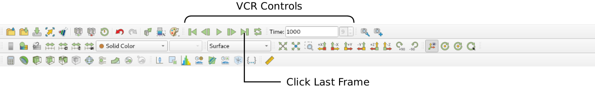
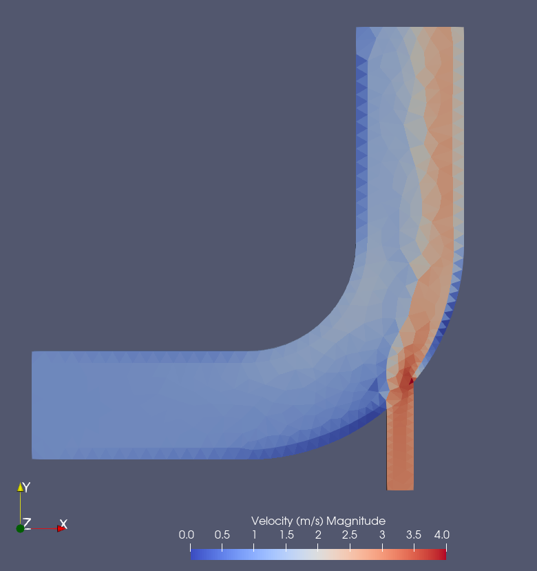
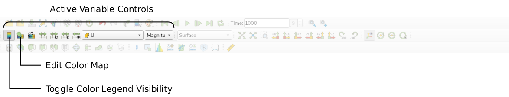
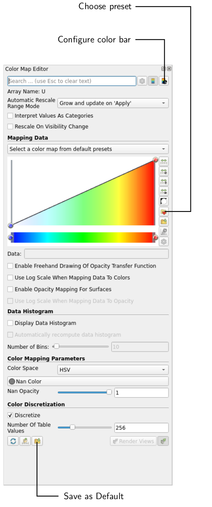
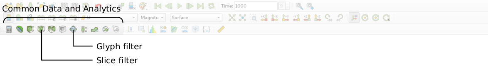
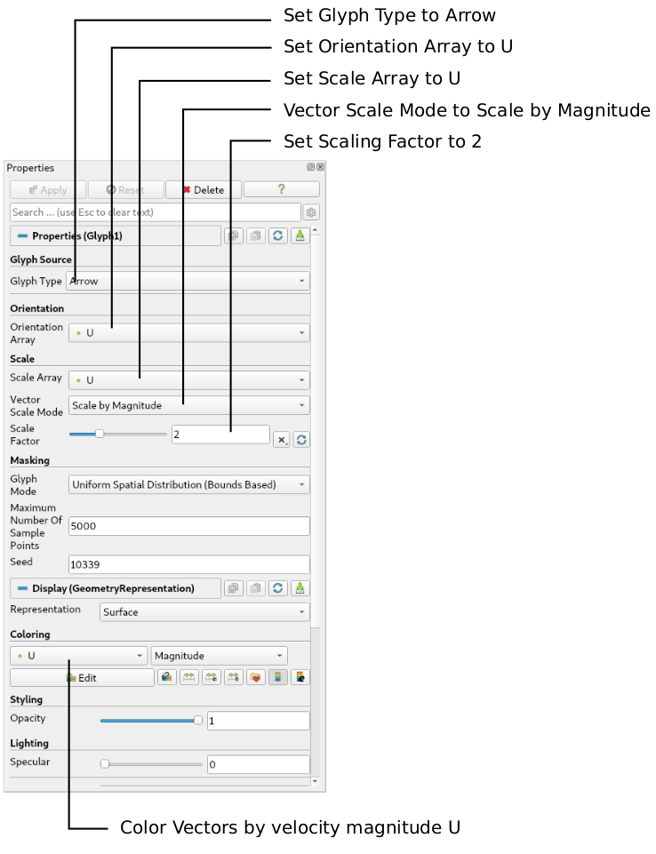
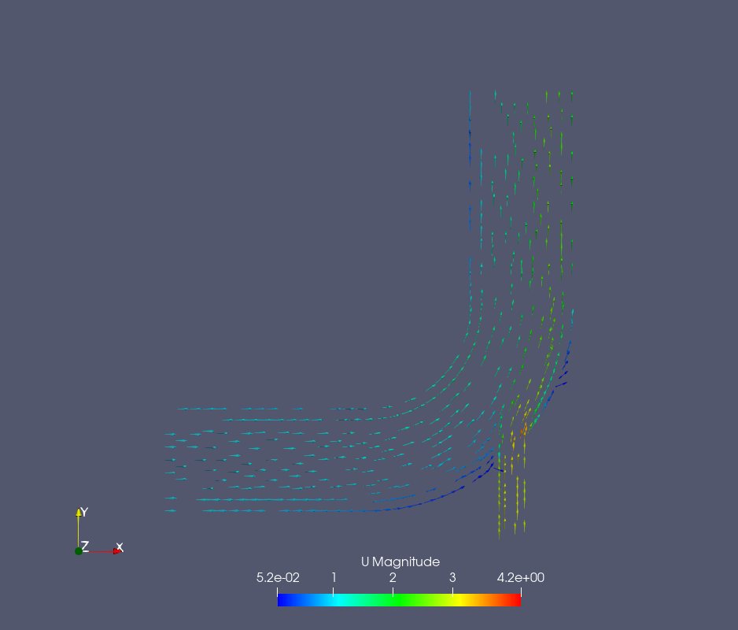

# Post-processing

As soon as results are written to time directories, they can be viewed using ParaView. Return to the ParaView window, which shows the mesh, and select the **Properties** panel for the `elbow.foam` case module. If the correct window panels for the case module do not seem to be present at any time, please ensure that: `elbow.foam` is highlighted in blue; eye button alongside it is switched on to show the graphics are enabled.

To prepare ParaView to display the data of interest, the data at the required iteration of 1000 must be loaded. If the case was run while ParaView was open, the output data in time directories will not be automatically loaded within ParaView. To load the data the user should click **Refresh** at the top **Properties** window (scroll up the panel if necessary).

The solution at iteration 1000 can be viewed by using the **VCR Controls** at the very top of the ParaView window and click the button for **Last Frame**:

## Coloring surfaces

To view the velocity contours of the flow, the following settings must be selected in the **Properties** panel, as descriped in the following figure:
 1. Select **Surface** from the **Representation** menu,
 2. Select **Coloring** by velocity magnitude `U` at the cell centers, and
 3. Select **Rescale to Data Range**, if necessary.

The velocity field looks like expected: The velocity magnitude at the left inlet is low with $1\\,\text{m/s}$ while the it is high with $3\\,\text{m/s}$ at the bottom inlet. However, it is also evident that the boundary layer is only poorly resolved indicated by the velocity checker-boarding visible at the left and right wall close to the outlet.

> **Note**
>
> It is important to note that there are two ways to display fields in ParaView: either as interpolated values indicated by a *dot* symbol in front of the variable name, and as cell center values indicated by a *cell* symbol in front of the variable name. The cell center values are recommended for inspection of the results as interpolated values might obscure numerical problems and unphysical values, such as the checker-boarding in this case.

A colour legend can be added by clicking the **Toggle Color Legend Visibility** button in the **Active Variable Controls** toolbar. The legend can be located in the image window by drag and drop with the mouse.

The **Edit Color Map** button in the **Active Variable Controls** toolbar opens the **Color Map Editor** window, where the user can set a range of attributes of the colour scale and the color bar.

In particular, ParaView defaults to using a colour scale of blue to white to red rather than the more common blue to green to red (rainbow). Therefore the first time that the user executes ParaView, they may wish to change the colour scale. This can be done by selecting the **Choose Preset** button (with the heart icon) in the **Color Map Editor**. The conventional color scale for CFD is Blue to Red Rainbow can be found when the user types the name in the **Search** bar.

After selecting Blue to Red Rainbow and clicking **Apply** and **Close**, the user can click the **Save as Default** button at the absolute bottom of the panel (file save symbol) so that ParaView will always adopt this type of colour bar. The user can also edit the color legend properties, such as text size, font selection and numbering format for the scale, by clicking the **Edit Color Legend Properties** to the far right of the search bar, as shown in the figure above.

## Cutting plane (slice)

If the user rotates the image, by holding down the left mouse button in the image window and moving the cursor, they can see that they have now coloured the complete geometry surface by the velocity. In order to produce a genuine 2-dimensional contour plot the user should first create a cutting plane, or ‘slice’. With the elbow.foam module highlighted in the **Pipeline Browser**, the user should select the **Slice** filter from **Common Data and Analytics** in the top menu of ParaView:

The cutting plane should be centred at $(0, 0, 0)$ and its normal should be set to $(0, 0, 1)$ (click the **Z Normal** button). By default, the pressure field will now be shown. The **Show Plane** in the **Properties** panel should be disabled as otherwise rotating the image with the mouse might change the plane orientation.

## Vector plot

We now wish to generate a vector glyph for velocity at the cutting plane. With the **slice1** module highlighted in the Pipeline Browser, the user should select the **Glyph** filter from the **Common Data and Analytics** menu (see figure above). The **Properties** window panel should appear as shown in the following figure:

In the resulting **Properties** panel, make sure the **Glyph Type** is set to **Arrow**, and the **Orientation Array** is the velocity field **U**. Then, set the **Scale Array** to **U** and **Vector Scale Mode** to **Scale by Magnitude**. This way, the size of the vectors will be scaled by the velocity magnitude and with a **Scaling Factor** of 2, the vectors will be clearly visible. At this point you can click **Apply** to show the vector plot on top of the Cutting plane defined previously.

The resulting vectors will be color coded by pressure, whereas a velocity color code would make much more sense. Therefore, the user should colour the glyphs by velocity magnitude which, as usual, is controlled by setting Color by U in the **Properties** panel. The user can also select **Show Color Legend** in Edit Color Map. Additionaly, the **slice1** module in the **Pipeline** Browser can be made invisible by clicking the **Eye** symbol next to the module name. The resulting output is shown in the following figure:

## Conclusion

This concludes the second tutorial. You simulated the incompressible, laminar flow through a pipe bend in 2D. We imported a externally created mesh file and checked its quality, we went through all settings in OpenFOAM, run the simulation and plotted the residuals. Finally, we visualized the flow field in Paraview.

At this point, you can continue with the additional tasks given in the [*README.md*](./README.md).
