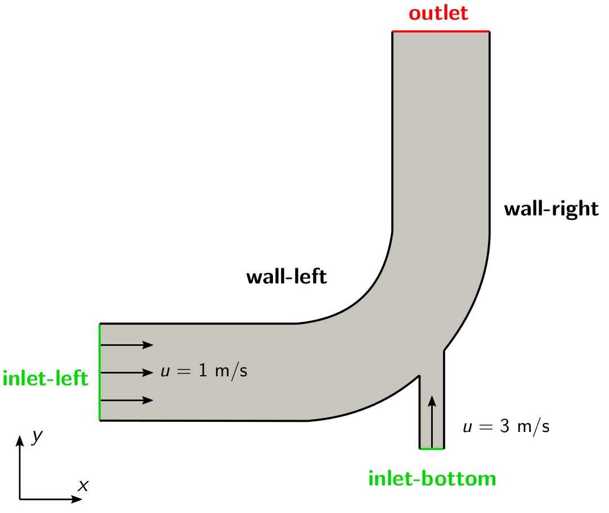
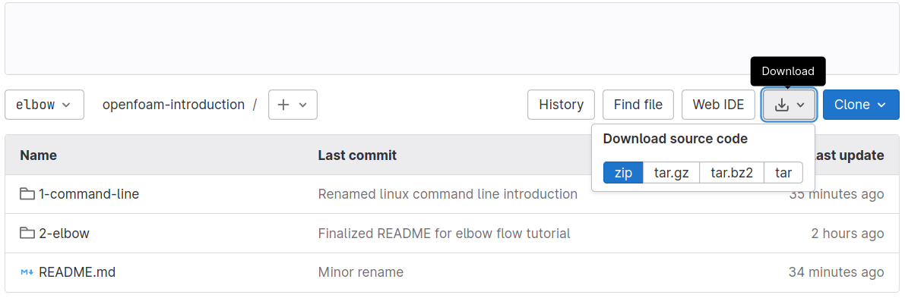

# Elbow


## Overview

This tutorial will describe how to pre-process, run and post-process a case involving isothermal, incompressible flow in a two-dimensional elbow domain. The geometry is shown in the following figure with an inlet on the left and bottom, stationary walls on the left and right and an outlet at the top. The initial inlet velocity at the left inlet will be $1\\,\text{m/s}$ and $3\\,\text{m/s}$ at the bottom inlet, respectively. The flow will be solved using the steady-state solver `simpleFoam` suitable for laminar and turbulent, isothermal, incompressible flows.




## Preparation

In order to work through the OpenFOAM tutorials, two things have to be done first: (1) Download this repository and extract the archive, and (2) adding an alias to the `.bashrc` for starting OpenFOAM.

#### (1) Downloading the archive

You can download the repository and all its content by clicking the **Download** button at the top right, then **Download Source Code** and choose a suitable file type as shown in the following figure:



The downloaded archive has the name `openfoam-introduction-main.tar.gz` (the ending depends on your chosen file type) and can be found in the `Downloads` folder inside your home. By right-clicking and selecting **Extract here**, the archive can be extracted.

#### (2) Creating an OpenFOAM alias

Whenever OpenFOAM is going to be used in a terminal, you have to source it at least once inside this terminal. This can be achieved by typing the following command inside the terminal:

```
source /app2/OpenFOAM/OpenFOAM-10/etc/bashrc
```

Once enter is pressed, OpenFOAM will be sourced and ready for usage. Utilities and solvers can now be executed by typing their respective name in the terminal. However, typing this command inside each new terminal can be time consuming and prone to error. Therefore, an alias will be used instead. In order to create this alias, the following command has to be executed once in the terminal:

```
echo 'alias of10="source /app2/OpenFOAM/OpenFOAM-10/etc/bashrc"' >> ~/.bashrc
```

Now close this terminal. From this point forward, you can source OpenFOAM simply by typing `of10` into a new terminal without the need to type the complex `source` command introduced earlier. This even persists after restarting the computer.


## Let's start

The user guide for this tutorial is divided into three parts: (1) Pre-processing, (2) solving the flow field, and (3) post-processing. Each part has a dedicated instruction named:
 * `1-pre-processing.md`,
 * `2-solving.md`, and
 * `3-post-processing.md`

found in the subfolder `2-elbow` in the repository. Before you start with the first part, use an existing terminal or open a new one and source OpenFOAM by typing:

```
of10
```

Next, you must change the working directory of the terminal to the `elbow` folder inside the downloaded repository directory. If the archive of this repository has been downloaded and extracted in the `Downloads` folder of your home, this can be achieved by typing:

```
cd ~/Downloads/openfoam-introduction-main/2-elbow/elbow
```

Once ready, you can scroll to the top of the page and click on the documentation for the first part called [*1-pre-processing.md*](./1-pre-processing.md).


## Additional tasks

Once you have successfully finished the second tutoral, you can solve the following, additional tasks:

 1. Copy the `elbow` folder and repeat the simulations, but this time increase the inlet velocities by a factor of 3. Plot the residuals. How do they compare to the residuals of the original case?
 2. Repeat the simulations once more, but this time increase the inlet velocities by a factor of 4 compared to the original case. What is the result of this and how do the residuals look like now? How can you improve the stability of the simulation and gain a fully converged solution?
 3. Plot the velocity profile at the outlet with ParaView. For this, use the **Plot over Line** filter and specifiy the starting and end points of the corresponding line as follows: Starting point at `(48 64 0)` and end point at `(64 64 0)`.
 4. How does the velocity profile at the outlet change, when using a first order upwind discretization scheme for the convective term? For this, replace the entry `bounded Gauss linearUpwindV cellLimited 1;` for `div(phi,U)` with `bounded Gauss upwind;` in the file `fvSchemes`.
 5. How does the simulation results change, if you set set the uniform pressure at the outlet to $1000\,\text{m}^2\text{s}^2$?
