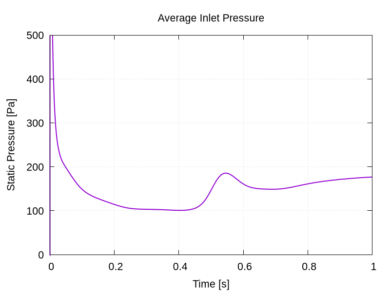
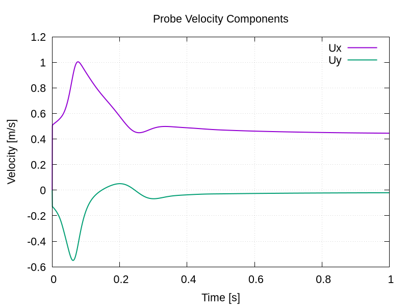
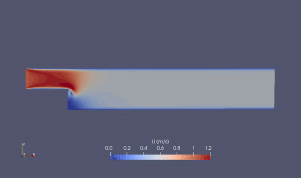
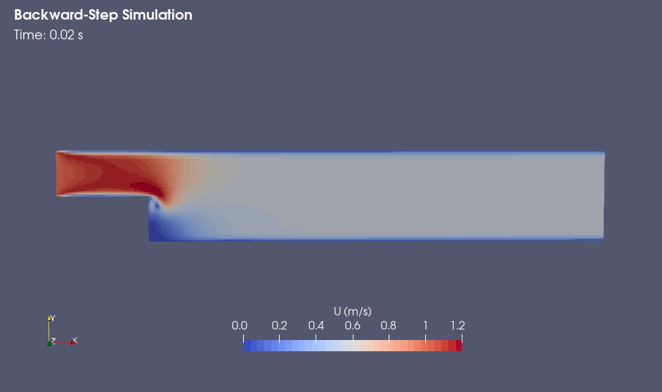
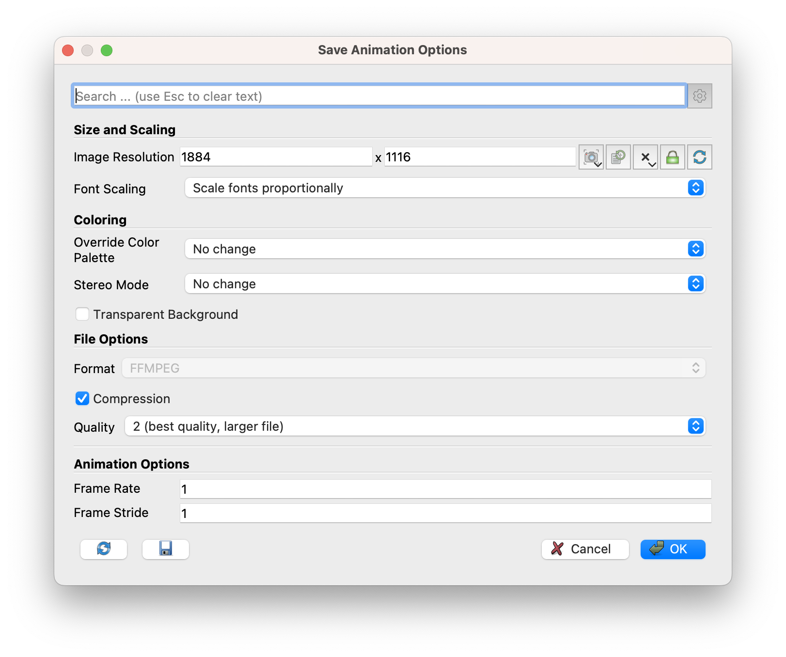

# Post-processing

Once the simulation has finished and all the time directories are written out, the simulation results can be analysed. First, let us examine the data written by the function objects: the average inlet pressure and velocity components at the probe location.

> **Note**
>
> In order to quickly evaluate the monitored results from the function objects, gnuplot scripts are added to the `backward-step` case directory. Executing them automatically creates the diagramms for residuals, average inlet pressure and probe velocity components. By typing the following command in the terminal, the diagrams are automatically created using gnuplot and stored as **png** files:
> ```
> gnuplot create_plots.gnu
>```

## Average inlet pressure

Similar to the residuals data, the average inlet pressure is written to the file `postProcessing/averageInletPressure/0/surfaceFieldValue.dat` and can be plotted with any tool available, such as Microsoft Excel, gnuplot or python. The resulting diagram will look like follows:



Just as the residuals have indicated, the simulation does not seem to have reached a fully steady-state case yet. The average static pressure at the inlet after $1\\,\text{s}$ simulation time is close to $175\\,\text{Pa}$.


## Probes velocity components

The velocity components for each time step monitored by the `probes` function object are stored in the file `postProcessing/probes/0/U`. Once plotted, they reveal that the velocity components stay fairly constant after $0.6\\,\text{s}$:




## Velocity animation

A good way to visualize the transient flow behaviour is an animation created with ParaView. For this, display the velocity magnitude in a range from $(0 - 1.2)\\,\text{m/s}$. By clicking the **Play** button at the VCR-controls at the very top, it is possible to automatically go through every time step and get a quick glance of how the transient flow field looks like:



Before creating an animation, it is recommended to add more information to the view. First of all, a title could be added by clicking on the top menu: **Sources** $\rightarrow$ **Annotations** $\rightarrow$ **Text**. You can type any text in the text field inside the **Properties** panel, adjust font size and location of the text field. Secondly, you could add the current time step to the view, again by using the top menu: **Sources** $\rightarrow$ **Annotations** $\rightarrow$ **Annotate Time**. Choose a suitable time **Format**, such as `Time: {time:1.2f} s` to display the time with two digits and the unit seconds. All in all, this could look like follows:



At this point, the animation can easily be created by clicking the top menu: **File** $\rightarrow$ **Save Animation...**, and choosing a suitable file name and format (preferably **mp4**). At the following **Animation Menu**, you can specify video resolution, compression, and frame rate. It is recommended to change the frame rate to a higher value, such as $(10 - 15)\\,\text{fps}$. Clicking **Okay** will create the animation for you.


