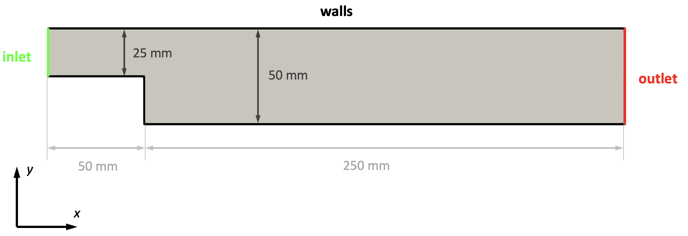

# Backward-facing Step

## Objectives

The objectives for this tutorial are as follows:
  * Create a block-structured mesh using the tool `blockMesh` and scale it with `transformPoints`,
  * Estimate the correct time step size based on Courant number,
  * Perform a transient, incompressible simulation with `pimpleFoam`,
  * Analyse the flow field using runtime postprocessing and ParaView.


## Overview

This tutorial will describe how to pre-process, run and post-process a case involving a transient, isothermal, incompressible flow over a two-dimensional backward-facing step. The geometry is shown in the following figure with an inlet on the left, stationary walls on the top and bottom, and an outlet at the right. The flow will be solved using the transient solver `pimpleFoam` suitable for laminar and turbulent, isothermal, incompressible flows.




## Preparation

In order to work through the OpenFOAM tutorial, make sure to download the latest version of the seminar repository and extract it inside your `Downloads` folder. Next, you must change the working directory of the terminal to the `backward-step` folder inside the downloaded repository directory. If the archive of this repository has been downloaded and extracted in the `Downloads` folder of your home, this can be achieved by typing:

```
cd ~/Downloads/Introduction-into-CFD-main/3-backward-step/backward-step
```

Then, you have to source OpenFOAM by either typing

```
source /app2/OpenFOAM/OpenFOAM-10/etc/bashrc
```

*or* if you set up the alias in the previous tutorial

```
of10
```

into the terminal.

Once ready, you can scroll to the top of the page and click on the documentation for the first part called [*1-pre-processing.md*](./1-pre-processing.md).

## Tasks for this tutorial

  1. Create the mesh using `blockMesh`
  2. Check the mesh quality using `checkMesh` and scale the mesh correctly using `transformPoints` 
  3. Specify the types and values of the boundary conditions for kinematic pressure `p` and velocity `U` in the `0` folder
  4. Correctly set the kinematic viscosity `nu` in the `physicalProperties` file to achieve a Reynolds-number of 250 at the inlet
  5. Set the time step size `deltaT` to a value so that a maximum Courant number of $\text{Co} \approx 0.5$ is kept
  6. Run the simulation using `pimpleFoam`
  7. Judge convergence using the results from the function objects by plotting them with the provided gnuplot script
  8. Visualize the transient velocity field using ParaView and save an animation.


## Additional tasks

Once you have successfully finished the third tutoral, you can solve the following, additional tasks:
  * Name three ways to increase the Reynolds-number of the numerical model to 2500. Choose one way and repeat the simulations this Reynolds-number. How does the velocity components at the probe location change? Create a new animation with both simulations side-by-side.
