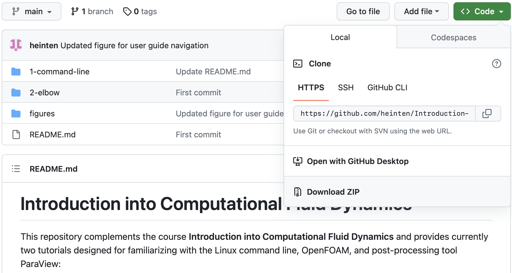

# Introduction into Computational Fluid Dynamics


This repository complements the course **Introduction into Computational Fluid Dynamics** and provides currently three guided tutorials designed for familiarizing with the Linux command line, OpenFOAM, and post-processing tool ParaView:

 1. A introduction into the Linux command line ([Link](./1-command-line/README.md))
 2. Simulating of an incompressible flow through an elbow ([Link](./2-elbow/README.md))
 3. Simulation of the transient, incompressible flow over a backward-facing step ([Link](./3-backward-step/README.md))

More tutorials will be added throughout the semester.


## How to use this guide

This repository offeres a step-by-step introduction both into the Linux command line as well as OpenFOAM for simulation and ParaView for post-processing. If you are already familiar with the Linux command line, you can skip the first part and directly work on the second tutorial dealing with the simulation of an incompressible flow in an elbow.

You can navigate through the repository and display the indidual instructions using the web browser by clicking on the corresponding folder (recognizable by the folder symbol to the left of the name) or directly on the documentation (recognizable by the file ending `md`):


At the top of the repository or when switching to a certain folder, the corresponding `README.md` is always shown by default below the files list. This is the instruction for this specific tutorial. The idea of working through the user guide is as follows: Open the corresponding documentation and Readme files with a web browser and follow them closely. In parallel, open a terminal and go through the commands and instructions provided.

The respository contains pre-configured OpenFOAM cases, which will be used as tutorials. Therefore, all files inside this GitHub repository have to be downloaded. This can be done by clicking the green **Code** button at the top right and select **Download ZIP**:



Save the archive wherever you want to run your simulations (e.g. a new `simulations` directory inside your `home`), unzip it and keep it ready for the OpenFOAM tutorials.

---

Throughout the user guide, commands for the command line are formatted as follows:
```
pwd
```
This example indicates that the command `pwd` should be typed into the terminal.

Content of files within the user guide are shown with line numbers as follows:

```
1   /*--------------------------------*- C++ -*----------------------------------*\
2     =========                 |
3     \\      /  F ield         | OpenFOAM: The Open Source CFD Toolbox
4      \\    /   O peration     | Website:  https://openfoam.org
5       \\  /    A nd           | Version:  10
6        \\/     M anipulation  |
7   \*---------------------------------------------------------------------------*/
8   FoamFile
9   {
10      format      ascii;
11      class       dictionary;
12      object      blockMeshDict;
13  }
14  // * * * * * * * * * * * * * * * * * * * * * * * * * * * * * * * * * * * * * //
15
```


## Disclamer

This offering is not approved or endorsed by OpenCFD Limited, the producer of the OpenFOAM software and owner of the OPENFOAM® and OpenCFD® trademarks.
